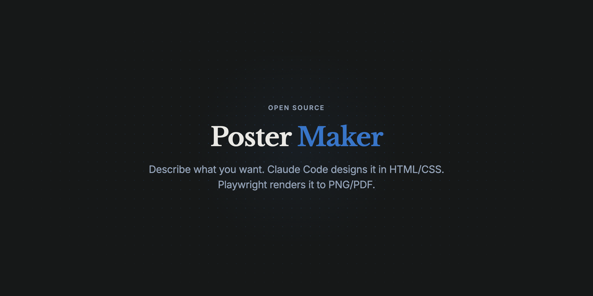
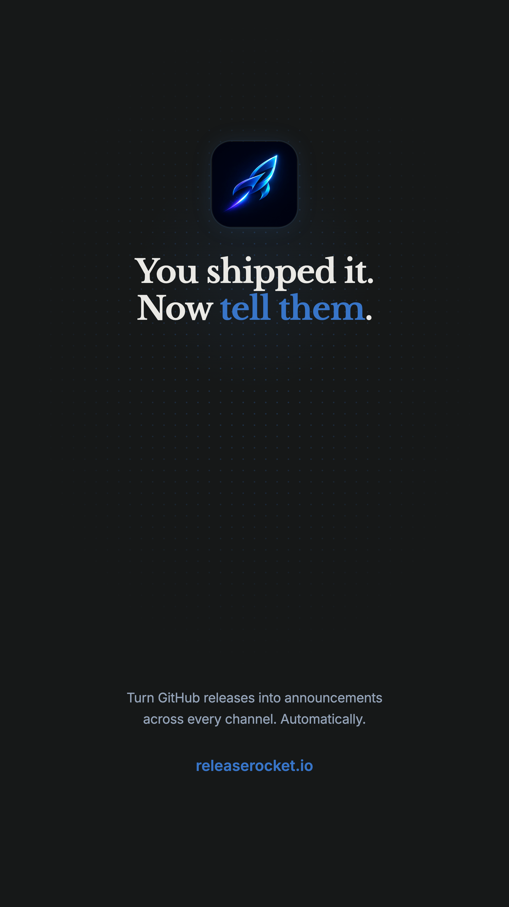

# Poster Maker



Generate professional marketing posters with [Claude Code](https://claude.com/claude-code). No Figma, no Photoshop, no Canva — just describe what you want.

## Get started

Fork this repo, clone your fork, open [Claude Code](https://claude.com/claude-code), and run:

```
/setup
```

This installs everything, exports the ReleaseRocket example above to verify it works, and shows you how to make your first poster.

By forking, your posters, assets, and design preferences sync through GitHub — pick up where you left off on any machine. As you work, Claude learns your style through `CLAUDE.md` and your conversation history stays with the project.

## Make a poster

```
/new-poster DJ gig flyer for "SOLAR FREQUENCIES" at Club Elysium, bright euphoric EDM style
```

That's it. Claude designs the poster, opens it in your browser, and asks if you want changes.

More examples:

```
/new-poster product launch for a fitness app, clean modern, neon green accent
```
```
/new-poster conference talk poster for "Building with AI" by Jane Smith, minimal corporate
```
```
/new-poster 1024x1024 app icon for MyApp, use assets/myapp/logo.png, subtle glow, transparent background
```

## Iterate

Just talk to Claude:

- *"make the title bigger"*
- *"darker, more contrast"*
- *"try a different font"*
- *"add a glow effect"*
- *"make it feel more underground"*

It updates the poster and shows you the result each time.

## Use your own images

Drop photos or logos into `assets/` and mention them in your prompt:

```
/new-poster event poster, use assets/my-event/photo.jpg as background, dark moody style
```

Need to cut someone out of a photo?

```
/remove-bg assets/my-event/photo.jpg
```

## Export

When you're happy:

```
/export-poster my-poster.html
```

Exports to high-res PNG or PDF in `exports/`.

## Formats

Default is Instagram Story (1080x1920). You can also ask for `story`, `square`, `landscape`, `github` (1280x640 social preview), `a4`, `a3`, or any custom size like `1024x1024`.

## How it works under the hood

Each poster is a single HTML file with inline CSS — no frameworks, no build step. Claude uses Google Fonts for typography and pure CSS for everything else: gradients, glow effects, grain textures, blend modes, and image compositing.

You can open any poster in a browser to preview it. When you're ready to export, [Playwright](https://playwright.dev/) launches a headless Chromium browser to render the HTML and capture it as a high-res PNG (2x) or PDF.

All the design knowledge — font pairings, color palettes, layout rules, Instagram safe zones — lives in the slash command files (`.claude/commands/`). You can tweak these to match your own style.

## Requirements

- [Claude Code](https://claude.com/claude-code) — Anthropic's AI coding agent (requires a [Claude Pro, Max, or API](https://claude.ai) plan)
- [Node.js](https://nodejs.org/)
- Python 3 (optional, only for `/remove-bg`)

## Examples

 

*The [ReleaseRocket](https://www.releaserocket.io/) app icon (corner radius + glow added to an existing logo) and a promo poster.*

## License

[MIT](LICENSE)

---

Built by the maker of [ReleaseRocket](https://www.releaserocket.io/) — turn your GitHub releases into announcements across every channel.
